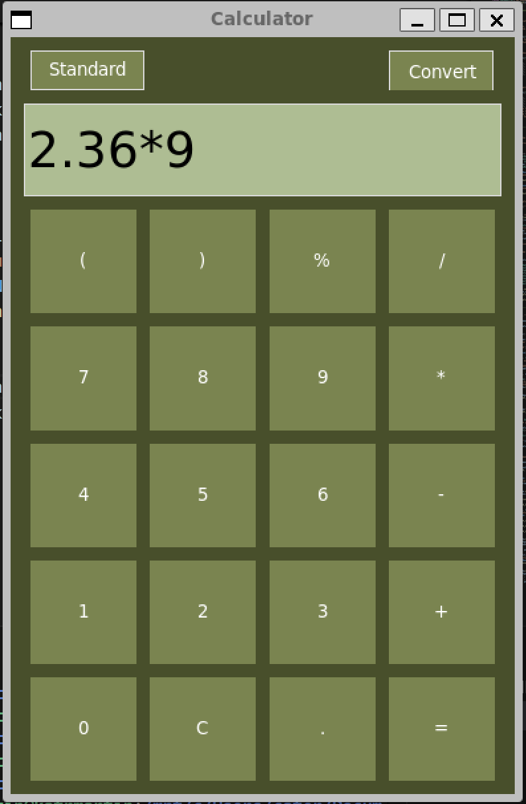

# OOP-FinalProject
Final Project CSCI375 (Fall 2024)
## Calculator with Unit Conversion
---
A python GUI calculator application that supports standard mathematical operations and expressions, as well as various unit conversions.

### Students
- Matheus Lazzuri	 (mslazzuri)
- Carson White		 (carsonsw09)
- Katie Martin		 (katrmartin)
---

## How to run:
1. **Clone the repository**
    ```bash
    git clone https://github.com/mslazzuri/OOP-FinalProject
    ```

2. **Install Python3 and dependencies, if necessary**

    ```bash
    pip install tk
    ```

3. **Navigate to folder, and start:**
    ```bash
    python3 main.py
    ```
    or
    ```bash
    make run
    ````

**or for checks and tests:**
    ```
    make all
    ```

## Screenshots
### **Calculator Standard Mode:**



### **Calculator Convert Mode:**

